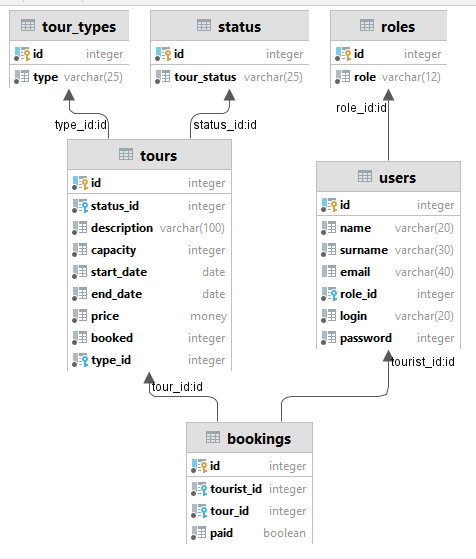

# ServletTour
Java course project

Начальная идея приложения состоит в следующем:
Администратор наполняет сайт предложениями различных экскурсионных туров (впоследствии, если времени хватит, через какое-нибудь REST API), 
Пользователь выбирает и регистрируется на выбранный тур

Дамп базы данных в вмиде скрипта (надеюсь, правильно сделал) находится в папке resources